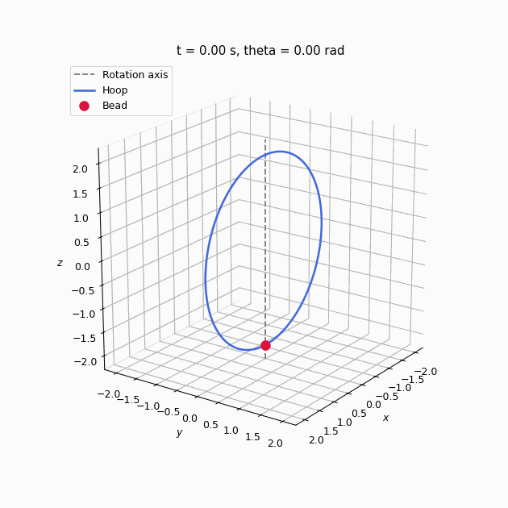

# Physical Systems

A portfolio combining derivations, numerical approximation and visualisation to assist intuition to otherwise complex topics. It is organised into three largely distinct sections, **numerical analysis**, **non-quantum physical systems** and **quantum systems**, which can be explored separately.

*A bead moving on a vertically rotating hoop. [Open the full mechanics project](non_quantum_systems/bead_on_rotating_hoop/) or [view the MP4 render](non_quantum_systems/bead_on_rotating_hoop/media/bead_on_rotating_hoop.mp4).*

## Explore the portfolio

- [Numerical analysis](#1-numerical-analysis) — interpolation, conditioning, quadrature and numerical ODE methods.
- [Non-quantum physical systems](#2-non-quantum-systems) — classical mechanics, more to come
- [Quantum systems](#3-quantum-systems) — finite-well tunnelling, more to come

## 1. Numerical analysis

[Browse the numerical-analysis section](numerical_analysis/)

Four notebook-led university assignments, completed in collaboration with another university student, with numerical algorithms separated into reusable .py files.

- [Assignment 1](numerical_analysis/numerical_methods_assignment_1/) — condition numbers, linear and Lagrange interpolation.
- [Assignment 2](numerical_analysis/numerical_methods_assignment_2/) — Lebesgue constants, Newton interpolation and elementary quadrature rules.
- [Assignment 3](numerical_analysis/numerical_methods_assignment_3/) — composite and Gaussian quadrature, convergence behaviour and explicit ODE methods.
- [Assignment 4](numerical_analysis/numerical_methods_assignment_4/) — stability regions, explicit and diagonally implicit Runge–Kutta methods.

## 2. Non-quantum systems

[Browse the non-quantum section](non_quantum_systems/)

Projects in classical and continuum mechanics, developed from derivations, through solution and analysis, ending with a visual.

- [Bead on a rotating hoop](non_quantum_systems/bead_on_rotating_hoop/) — an analytical and numerical study of nonlinear motion, effective energy, equilibrium stability, bifurcation and small oscillations, ending with the above 3D render.
- [Kinetic Fokker–Planck solver](non_quantum_systems/kinetic_fokker_planck_solver/) — a C99 finite-difference phase-space solver using operator splitting, discretising upwind and LAPACKE banded linear systems.

## 3. Quantum systems

[Browse the quantum section](quantum_systems/)

Projects based on analytical structure, numerical eigensolvers and wavefunction visualisation.

- [Quantum Tunnelling — Finite Potential Well](quantum_systems/quantum_tunnelling/) — numerical bound states, classically forbidden tails, time evolution and a separable three-dimensional extension with interactive probability-density visualisations.

## Approach and tools

The projects consist mainly of derivations and analysis in Jupyter notebooks with focused Python modules for models, solvers, plotting and animation. The main Python stack is NumPy, SciPy, Matplotlib and pandas, with Plotly and ipywidgets used for interactive quantum visualisations. C and LAPACKE are used for the kinetic Fokker–Planck solver.
