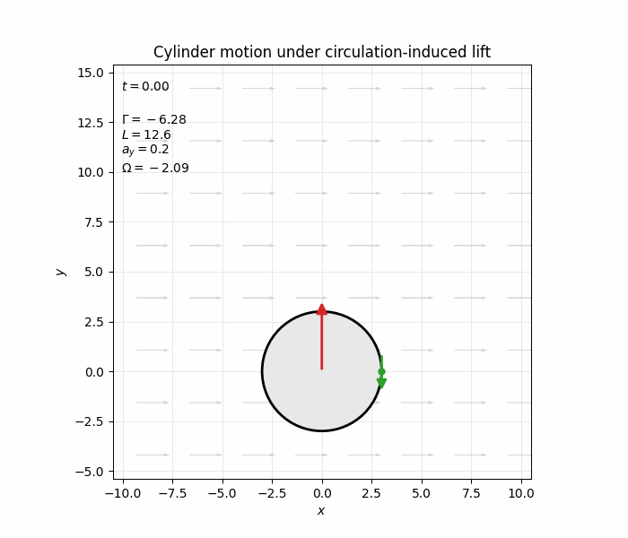

# Potential Flow Around a Circular Cylinder



This project investigates the mathematics behind the above GIF from an analytic and computational perspective. It begins with the governing equations for two-dimensional potential flow, introduces the complex potential and derives several elementary flows. These solutions are then combined to construct flow around a circular cylinder, before using Bernoulli's equation to study the pressure distribution, circulation and lift. The project ends with the above render of the resulting cylinder motion.

## Assumptions

The model assumes:

- 2D, steady, inviscid, incompressible, potential flow, which is irrotational away from singularities
- the cylinder is rigid and infinitely long. Forces are therefore calculated per unit length
- no-penetration and far-field conditions on the flow
- circulation, where considered, is constant
- gravity, viscous drag, boundary layers and flow separation are neglected

Because viscosity is neglected, the model predicts zero drag. This is known as d'Alembert's paradox, and is broken by considering a boundary layer near the surface, which gives drag and can lead to vortex shedding. This is not discussed in this project, and the final render is a visualisation of the Kutta-Joukowski lift caused by constant circulation and a freely moving cylinder

## Model

For a velocity field \(\mathbf{u}=(u,v)\), by definition, incompressibility and irrotationality give:

\[
\nabla\cdot\mathbf{u}=0,
\qquad
\nabla\times\mathbf{u}=\mathbf{0}.
\]

The velocity potential \(\phi\) and stream function \(\psi\) satisfy

\[
\mathbf{u}=\nabla\phi,
\qquad
\mathbf{u}=
\left(
\frac{\partial\psi}{\partial y},
-\frac{\partial\psi}{\partial x}
\right),
\]

hence both satisfy the Laplace equation. We combine them as follows to get the so-called 'complex potential':

\[
w(z)=\phi(x,y)+i\psi(x,y),
\qquad
\frac{dw}{dz}=u-iv.
\]

Streamlines are contours of \(\psi\), and equipotential surfaces are contours of \(\phi\). Cauchy-Riemann gives that these are orthogonal to one another

## Elementary flows and superposition

The notebook derives, plots and gives intuition for the complex potentials for uniform flow, a point source/sink, a point vortex and a dipole. Since Laplace's equation is linear, these flows can be combined together, and we still get a valid complex potential.

Specifically, combining a uniform flow and a dipole gives

\[
w(z)=U\left(z+\frac{a^2}{z}\right),
\]

which describes potential flow around a circular cylinder of radius \(a\). The circle \(r=a\) is a streamline and the no-penetration boundary condition is satisfied.

## Pressure and drag

On the cylinder surface, the radial velocity vanishes and the velocity in the angular direction is given by:

\[
u_r(a,\theta)=0,
\qquad
u_\theta(a,\theta)=-2U\sin\theta.
\]

Applying Bernoulli's equation/principle gives the surface pressure coefficient

\[
C_p(\theta)
=
\frac{p(a,\theta)-p_\infty}{\tfrac12\rho U^2}
=1-4\sin^2\theta.
\]

The pressure distribution is symmetric in both vertical and horizontal directions, and hence produces zero net drag or lift. The lift is covered below. The drag effect is known as d'Alembert's paradox, and is broken by considering a small boundary layer near the surface where the flow is viscous. This is not covered here.

## Circulation and lift

Adding a point vortex with circulation \(\Gamma\) at the centre of the cylinder gives the new complex potential:

\[
w(z)
=
U\left(z+\frac{a^2}{z}\right)
-\frac{i\Gamma}{2\pi}\log z.
\]

The cylinder boundary remains a streamline (still constant), but its surface velocity becomes

\[
u_\theta(a,\theta)
=
-2U\sin\theta+\frac{\Gamma}{2\pi a}.
\]

The circulation moves the stagnation points and creates a vertical pressure gradient, leading to a force which depends on the sign of the circulation. Integrating the 'pressure force' around the surface gives:

\[
D'=0,
\qquad
L'=-\rho U\Gamma.
\]

Where these forces are per unit length. This is the Kutta-Joukowski lift relation known as the Magnus effect. Negative circulation gives upward lift, while positive circulation gives downward 'lift'.

## Project structure

```text
potential_flow/
├── potential_flow.ipynb
├── model_flow.py
├── plotting_flow.py
├── render_flow.py
├── media/
│   ├── lifting_cylinder.gif
│   └── lifting_cylinder.mp4
└── README.md
```

- `potential_flow.ipynb` — deriving equations, plotting and interpreting flows
- `model_flow.py` — complex potential and velocity functions
- `plotting_flow.py` — plotting of streamlines, equipotential surfaces, and surface pressure distributions
- `render_flow.py` — rendering the lift of the cylinder caused by the circulation
- `media/` — GIF, MP4 (higher quality) renders of the cylinder lift.
